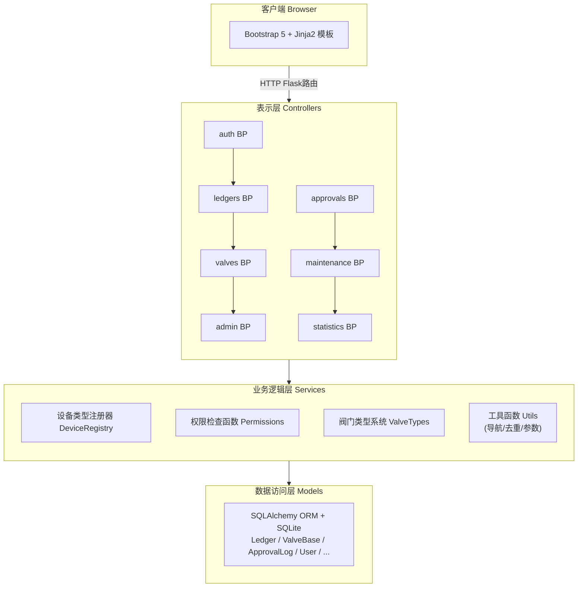

# 仪表阀门台账管理系统 — 系统架构设计文档

**版本**: 1.0  
**日期**: 2026-02-10  
**状态**: 初稿

---

## 1. 架构概览

系统采用分层单体 Web 架构，后端基于 Flask 框架，前端服务端渲染，数据库采用 SQLite。



## 2. 技术栈

| 层次 | 技术 | 说明 |
|------|------|------|
| 后端框架 | Flask 3.x | 应用工厂模式 |
| ORM | SQLAlchemy | 数据库模型与查询 |
| 数据库 | SQLite | 单文件存储 |
| 模板引擎 | Jinja2 | 服务端渲染 |
| 前端样式 | Bootstrap 5 | 响应式布局 |
| 认证 | Flask-Login | 会话管理 |
| Excel | pandas + openpyxl | 导入导出 |
| 测试 | pytest | 单元测试 |

## 3. 模块划分

### 3.1 路由模块

| 蓝图 | 职责 |
|------|------|
| `auth` | 登录/登出/密码管理 |
| `ledgers` | 台账合集 CRUD、阀门管理、批量操作 |
| `valves` | 阀门详情、编辑、删除 |
| `approvals` | 审批中心 |
| `admin` | 用户管理、系统设置 |
| `statistics` | 首页统计、工作台 |

### 3.2 核心模型

```
Ledger (台账合集)
  ├── ControlValve (调节阀)
  ├── OnOffValve (开关阀)
  ├── ValveAttachment (阀门附件)
  ├── ValvePhoto (阀门照片)
  └── MaintenanceRecord (检修记录)

ApprovalLog (审批日志)
User (用户)
Setting (系统设置)
```

### 3.3 设备类型注册器

采用注册表模式，每种阀门类型注册其模型类、字段定义、模板路径，实现多类型设备的统一管理：

```python
DeviceTypeRegistry.register(code, name, model_class, form_fields, templates)
```

## 4. 审批流设计

```
draft ──提交──▶ pending ──审批──▶ approved
                 │                   │
                 ├──驳回──▶ rejected  │
                 │                   │
                 └──── 编辑后进入 draft
```

关键机制：
- **审批快照**：审批通过时保存 `approved_snapshot_status/at`，修改后不影响已审批快照
- **动态状态**：台账合集状态根据其下所有阀门状态自动计算

## 5. 部署架构

```
单机部署:
  Python 3.10+ → Flask (waitress/werkzeug) → SQLite (.db文件)
  └── 静态文件 (static/) → 由 Flask 直接托管
```

最小依赖：Python 3.10+，无需外部数据库服务。
